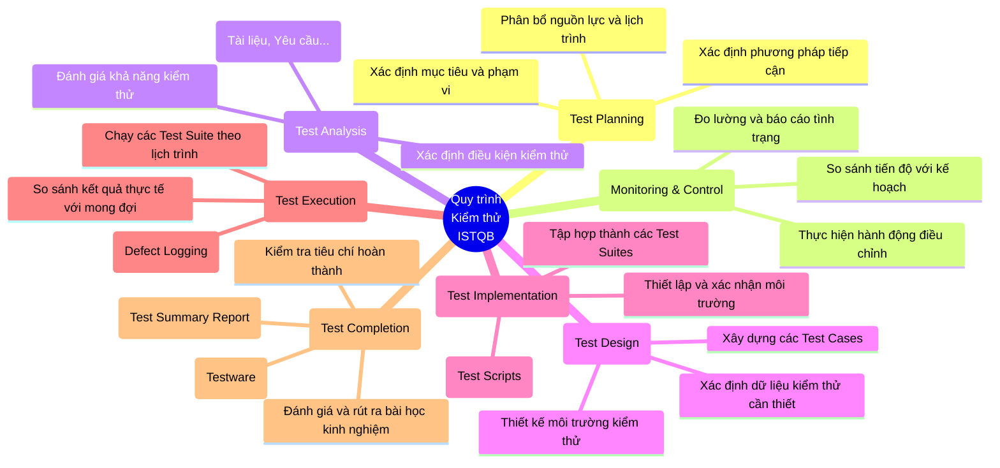

```mermaid
mindmap
  root((Quy trình
  Kiểm thử
  ISTQB))
    Lập kế hoạch (Test Planning)
      Xác định mục tiêu và phạm vi
      Phân bổ nguồn lực và lịch trình
      Xác định phương pháp tiếp cận
    Giám sát và Kiểm soát (Monitoring & Control)
      So sánh tiến độ với kế hoạch
      Đo lường và báo cáo tình trạng
      Thực hiện hành động điều chỉnh
    Phân tích (Test Analysis)
      Phân tích cơ sở kiểm thử (Tài liệu, Yêu cầu...)
      Xác định điều kiện kiểm thử
      Đánh giá khả năng kiểm thử
    Thiết kế (Test Design)
      Xây dựng các Test Cases
      Xác định dữ liệu kiểm thử cần thiết
      Thiết kế môi trường kiểm thử
    Triển khai (Test Implementation)
      Tập hợp thành các Test Suites
      Viết kịch bản tự động (Test Scripts)
      Thiết lập và xác nhận môi trường
    Thực thi (Test Execution)
      Chạy các Test Suite theo lịch trình
      So sánh kết quả thực tế với mong đợi
      Ghi nhận và báo cáo lỗi (Defect Logging)
    Kết thúc (Test Completion)
      Kiểm tra tiêu chí hoàn thành
      Viết báo cáo tổng kết (Test Summary Report)
      Lưu trữ tài sản kiểm thử (Testware)
      Đánh giá và rút ra bài học kinh nghiệm
```
