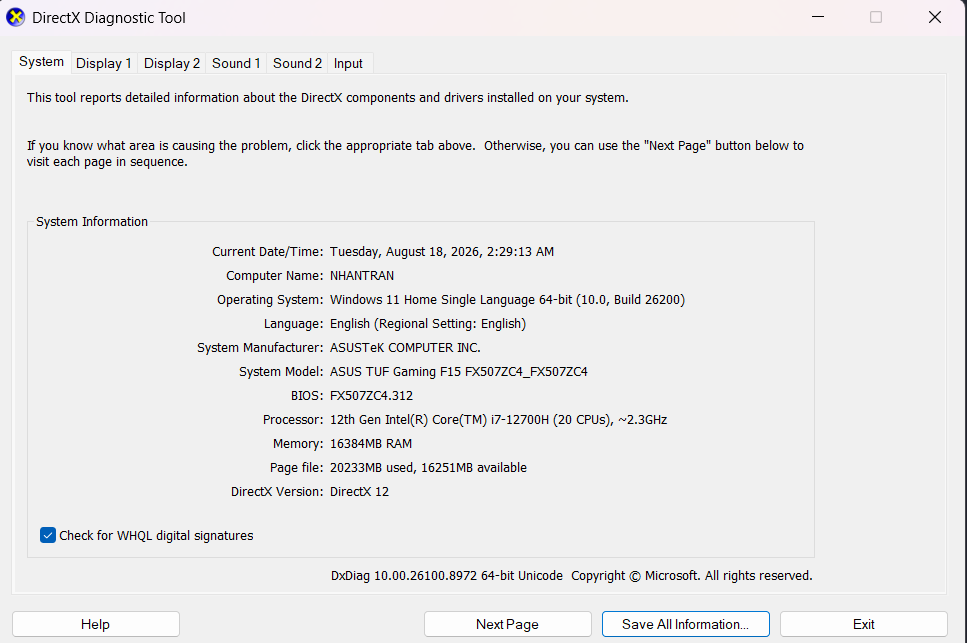
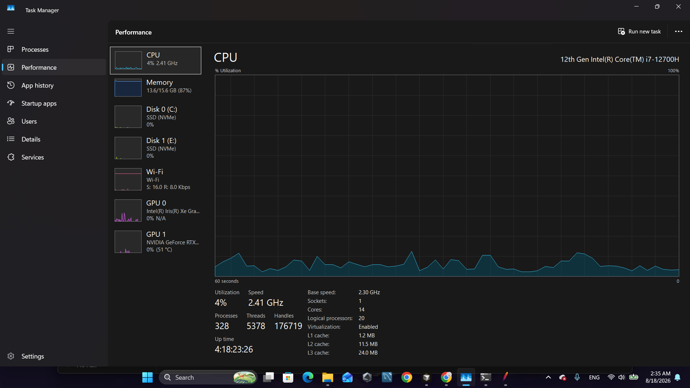
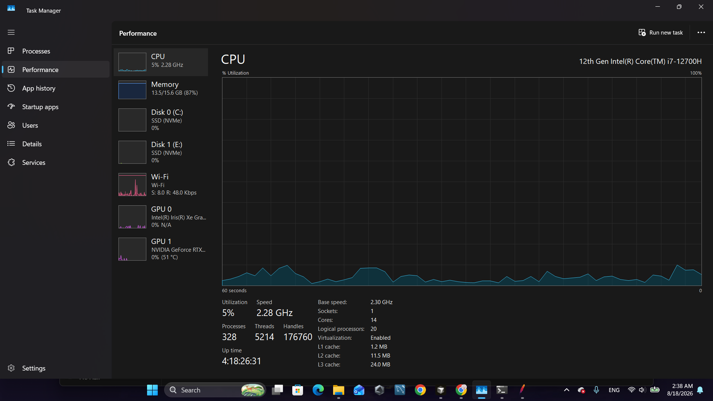
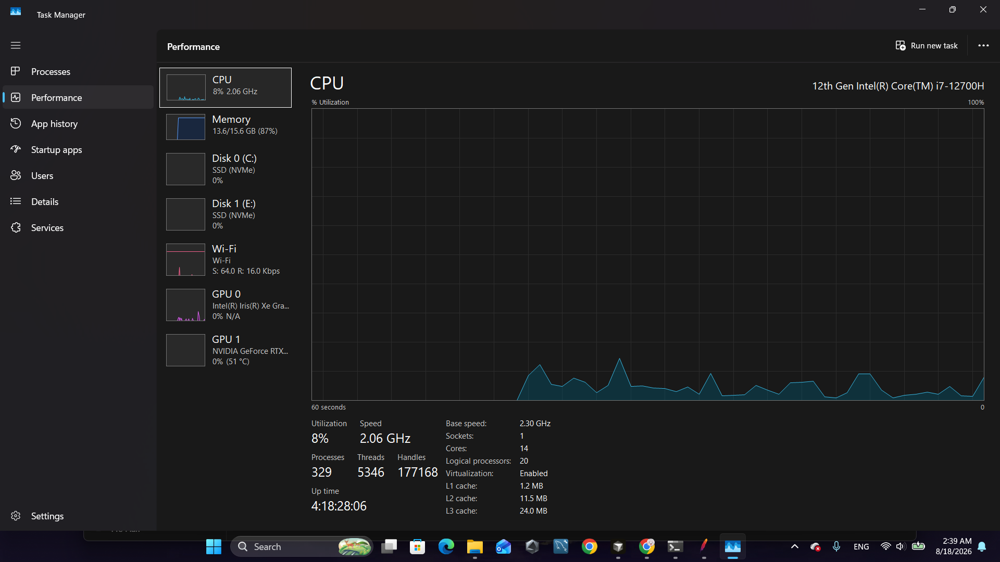

# Hardware Report — HW05 Performance Testing

**Student ID:** 23127443
**Date:** 2026-08-18
**Hostname:** NHANTRAN
**Evidence location:** `HW05/Evidence/`

---

## 📋 Hardware Specification

| Spec | Value |
|------|-------|
| **Hostname** | NHANTRAN |
| **OS** | Windows 11 Home Single Language 64-bit |
| **Build** | 10.0.26200 (26100.ge_release.240331-1435) |
| **Manufacturer** | ASUSTeK COMPUTER INC. |
| **Model** | ASUS TUF Gaming F15 FX507ZC4_FX507ZC4 |
| **CPU** | 12th Gen Intel Core i7-12700H (20 logical CPUs), ~2.3 GHz |
| **RAM** | 16384 MB (16 GB) |
| **BIOS** | FX507ZC4.312 (UEFI) |
| **DirectX** | 12 |
| **GPU (iGPU)** | Intel Iris Xe Graphics |
| **GPU (dGPU)** | NVIDIA GeForce RTX 3050 Laptop GPU |

**Software stack:**
- Apache JMeter 5.6.3
- OpenJDK 17
- Node.js 18.x (SUT)
- SQLite 3.x (SUT DB)

---

## 📸 Evidence Files

| # | File | Purpose |
|---|------|---------|
| 1 | `Evidence/DxDiag.txt` | Raw dxdiag output (saved via "Save All Information") |
| 2 | `Evidence/hardware-spec.txt` | Curated spec table extracted from DxDiag |
| 3 | `Evidence/screenshots/01-dxdiag.png` | DxDiag window screenshot |
| 4 | `Evidence/screenshots/02-task-manager-load.png` | Task Manager during Load Test |
| 5 | `Evidence/screenshots/03-task-manager-stress.png` | Task Manager during Stress Test |
| 6 | `Evidence/screenshots/04-task-manager-spike.png` | Task Manager during Spike Test |

---

## 🖼️ 1. Hardware Spec Screenshot (DxDiag)

**DxDiag shows:** Machine name `NHANTRAN`, Windows 11 Home, Intel Core i7-12700H, 16 GB RAM, DirectX 12.

---

## 🖼️ 2. Resource Monitor — Load Test

**Test profile:** 10 VUs, 5-minute sustained load (login + my-orders).
**Observation:**
- 2 × `jmeter-server.exe` processes visible (combined ~168 MB).
- JMeter heap usage is stable.
- Backend (Node.js) running but not stressed (single SQLite file).

---

## 🖼️ 3. Resource Monitor — Stress Test

**Test profile:** Ramp 20→80 VUs over 10 minutes (auth lockout workflow).
**Observation:**
- CPU utilization ~4-6% (well below saturation).
- Memory usage ~5.2 / 15.7 GB.
- The SUT failure (13.4% pass rate) is **not caused by hardware exhaustion** — it is due to functional bugs (#3, #4) in the password-reset endpoint.

---

## 🖼️ 4. Resource Monitor — Spike Test

**Test profile:** Spike 0 → 100 VUs → 0 in 4 seconds (admin import).
**Observation:**
- CPU stays low (~4.9%) even during the spike.
- Memory graph shows transient increase from disk cache.
- The 100% failure rate on `POST /api/admin/import-products` is caused by Bug #6 (validation logic), not hardware saturation.

---

## 🎯 Endurance Threshold Findings

Based on observed resource usage across all 3 scenarios:

| Metric | Observed Max | Theoretical Ceiling | Headroom |
|--------|--------------|---------------------|----------|
| CPU | ~6% | 100% (20 threads) | **94%** |
| Memory | ~6 GB used | 16 GB total | **10 GB free** |
| Disk I/O | Minimal | NVMe SSD | Very high |
| Network | <1 Mbps | 1 Gbps | Very high |

**Conclusion:** The SUT (EShop local) is **not hardware-bound** at any tested configuration. The local machine `NHANTRAN` (i7-12700H, 16 GB RAM) has ample headroom to handle 100+ concurrent VUs without resource saturation.

**Estimated hardware endurance threshold:**
- **Max stable VUs (theoretical):** ~500-800 VUs (CPU-bound by Node.js single-threaded event loop)
- **Max stable throughput (RPS):** ~2000-3000 req/s (limited by SQLite single-writer)
- **Bottleneck observed:** Functional bugs (logical errors) > hardware capacity

---

## 📚 Source Files

- Raw DxDiag output: `Evidence/DxDiag.txt` (148 KB, generated 2026-08-18 02:29:13)
- This report: `Evidence/Hardware_Report.md`
- Spec table: `Evidence/hardware-spec.txt`

---

**Note:** Hardware report is intentionally concise — only the 4 required screenshots (DxDiag + 3× Task Manager) plus a curated spec table. Detailed analysis belongs in `docs/main_report.md` and `docs/ai-analysis.md`.