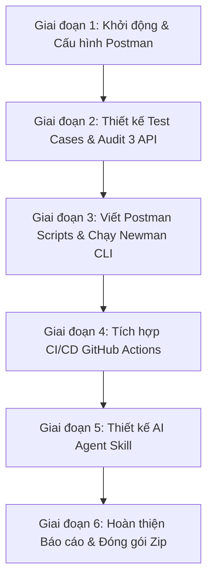

# KẾ HOẠCH THỰC HIỆN VÀ LỘ TRÌNH CHI TIẾT — HW06: KIỂM THỬ API

> **Mã bài tập:** HW06-AI — API Testing (EShop SUT)  
> **Sinh viên thực hiện:** [Họ và tên Sinh viên] — MSSV: `23127443`  
> **Hệ thống được kiểm thử (SUT):** EShop Backend (`http://localhost:3000`)  

---

## 1. GIẢI THÍCH CHI TIẾT VỀ BÀI TẬP HW06

### 🎯 1.1 Mục tiêu chính
Bài tập yêu cầu bạn áp dụng tư duy **AI-First Testing** kết hợp với kiến thức kiểm thử phần mềm nâng cao để:
1. **Thiết kế & Tự động hóa bộ kiểm thử API cho 3 API khác nhau** thuộc 3 nhóm tính năng (Pool A, Pool B, Pool C).
2. **Kiểm toán (Audit)** và mở rộng chất lượng kịch bản kiểm thử do AI sinh ra.
3. **Thực thi tự động hóa** bằng Postman + Newman CLI, xuất báo cáo HTML.
4. **Tích hợp Pipeline CI/CD** trên GitHub Actions với 2 commit mẫu (Pass 100% & Fail).
5. **Thiết kế một AI Agent Skill (API Test Generator)** ở cấp độ Bloom G9.5 (Create).

---

### 📌 1.2 Danh sách 3 API được lựa chọn (Không trùng lặp với nhóm)

* 🔹 **API 1 (Pool A - FR-05):** `GET /api/products` — Xem danh sách và tìm kiếm sản phẩm (`?search=keyword`).
* 🔹 **API 2 (Pool B - FR-11):** `GET /api/orders/my-orders` — Lấy lịch sử đơn hàng cá nhân (Bảo mật IDOR SEC-03, Auth SEC-01/02).
* 🔹 **API 3 (Pool C - FR-14):** `POST /api/categories` — Thêm mới danh mục sản phẩm của Admin (Leo thang quyền SEC-04, Auth Admin).

---

### 📊 1.3 Thang điểm đánh giá (Grading Rubric - 100 Điểm)

| **STT** | **Hạng mục đánh giá** | **Điểm tối đa** |
| :---: | :--- | :---: |
| **1** | **API 1 (`GET /api/products`):** Pipeline đầy đủ ($\ge 35$ cases + Audit + 5 Extend cases + Postman/Newman + Bugs) | 30 |
| **2** | **API 2 (`GET /api/orders/my-orders`):** Pipeline đầy đủ ($\ge 35$ cases + Audit + 5 Extend cases + Postman/Newman + Bugs) | 30 |
| **3** | **API 3 (`POST /api/categories`):** Pipeline đầy đủ ($\ge 35$ cases + Audit + 5 Extend cases + Postman/Newman + Bugs) | 30 |
| **4** | **Agent Skill (AI API Test Generator):** Sơ đồ kiến trúc Mermaid + Mã giả Python + Luồng chèn Custom Header Anti-AI-Cheat | 10 |
| | **TỔNG ĐIỂM** | **100** |

---

## 2. LỘ TRÌNH CÁC BƯỚC THỰC HIỆN CHI TIẾT (STEP-BY-STEP ROADMAP)

### 📍 GIAI ĐOẠN 1: DỰNG MÔI TRƯỜNG VÀ CẤU HÌNH POSTMAN
- [ ] **Bước 1.1:** Khởi chạy Backend EShop SUT local tại `http://localhost:3000` (`cd eshop/backend && node server.js`).
- [ ] **Bước 1.2:** Tạo Environment `EShop_Environment` trong Postman chứa:
  - `baseUrl`: `http://localhost:3000`
  - `student_id`: `23127443`
  - `user_token` & `admin_token`
- [ ] **Bước 1.3:** Tạo Collection `HW06_EShop_API_Testing` và dán **Pre-request Script cấp Collection** tự động chèn header `X-Student-Id: 23127443` (Anti-AI-Cheat).
- [ ] **Bước 1.4:** Tạo 2 Request Login (`POST /api/login`) để tự động lưu `user_token` và `admin_token` vào Environment.

---

### 📍 GIAI ĐOẠN 2: THIẾT KẾ TEST CASES, AUDIT & MỞ RỘNG CHO 3 API
Thực hiện lần lượt cho cả 3 API:
- [ ] **Bước 2.1 (API 1 - `GET /api/products`):** Sinh $\ge 35$ test cases (Domain, Dataflow, Security SQLi/XSS, Schema), lập bảng Audit (`VALID`/`INVALID`/`INCOMPLETE`), viết thêm 5 test cases mở rộng do con người thiết kế $\rightarrow$ Lưu file `API1_Products_TestCases.md`.
- [ ] **Bước 2.2 (API 2 - `GET /api/orders/my-orders`):** Sinh $\ge 35$ test cases (Lọc status, IDOR SEC-03, Schema), lập bảng Audit, viết 5 test cases mở rộng $\rightarrow$ Lưu file `API2_Orders_TestCases.md`.
- [ ] **Bước 2.3 (API 3 - `POST /api/categories`):** Sinh $\ge 35$ test cases (Admin creation, SEC-04 Privilege Escalation, Schema), lập bảng Audit, viết 5 test cases mở rộng $\rightarrow$ Lưu file `API3_Categories_TestCases.md`.

---

### 📍 GIAI ĐOẠN 3: THỰC THI THỰC TẾ TRÊN POSTMAN, NEWMAN VÀ BÁO CÁO LỖI
- [ ] **Bước 3.1:** Viết mã JavaScript Assertions (Chai.js) trong thẻ **Tests / Post-response** cho cả 3 API trong Postman.
- [ ] **Bước 3.2:** Export 2 file JSON từ Postman: `HW06_EShop_Collection.json` và `EShop_Environment.json`.
- [ ] **Bước 3.3:** Chạy lệnh Newman CLI xuất báo cáo HTML:
  `newman run HW06_EShop_Collection.json -e EShop_Environment.json -r cli,htmlextra --reporter-htmlextra-export newman_report.html`
- [ ] **Bước 3.4:** Đăng 2 Báo cáo lỗi (Bugs) lên trang GitHub Issues kèm ảnh chụp màn hình Postman.

---

### 📍 GIAI ĐOẠN 4: TÍCH HỢP CI/CD PIPELINE (GITHUB ACTIONS)
- [ ] **Bước 4.1:** Tạo file cấu hình tự động `.github/workflows/api-testing.yml`.
- [ ] **Bước 4.2:** Commit 1 (All Pass): Push code và chụp ảnh màn hình Workflow chạy thành công màu **XANH ✅**.
- [ ] **Bước 4.3:** Commit 2 (Test Fail): Cố tình sửa 1 assertion cho sai, push code và chụp ảnh màn hình Workflow báo lỗi màu **ĐỎ ❌**.
- [ ] **Bước 4.4:** Hoàn thiện file mô tả CI/CD `CICD_Report.md`.

---

### 📍 GIAI ĐOẠN 5: THIẾT KẾ AI AGENT SKILL (API TEST GENERATOR)
- [ ] **Bước 5.1:** Tự vẽ Sơ đồ kiến trúc Mermaid của AI Test Generator Agent.
- [ ] **Bước 5.2:** Viết mã giả Python mô tả luồng tự động hóa đọc API Spec $\rightarrow$ Chèn Anti-Cheat Header $\rightarrow$ Xuất Postman Collection.
- [ ] **Bước 5.3:** Lưu file `Agent_Skill_Design.md`.

---

### 📍 GIAI ĐOẠN 6: TỔNG HỢP BÁO CÁO & ĐÓNG GÓI ZIP NỘP BÀI
- [ ] **Bước 6.1:** Viết bài phê bình AI `AI_Critique.md` (200 – 300 từ).
- [ ] **Bước 6.2:** Ghi nhật ký tương tác đầy đủ mốc thời gian vào `AI_Audit_Report.md`.
- [ ] **Bước 6.3:** Hoàn thiện `README.md` tự đánh giá 100 điểm.
- [ ] **Bước 6.4:** Xuất `git_log.txt` bằng lệnh `git log --pretty=format:"%h - %an, %ar : %s" > git_log.txt`.
- [ ] **Bước 6.5:** Nén file `.zip` theo cú pháp `23127443_HW06_AI_API_100.zip` và nộp lên Moodle.
